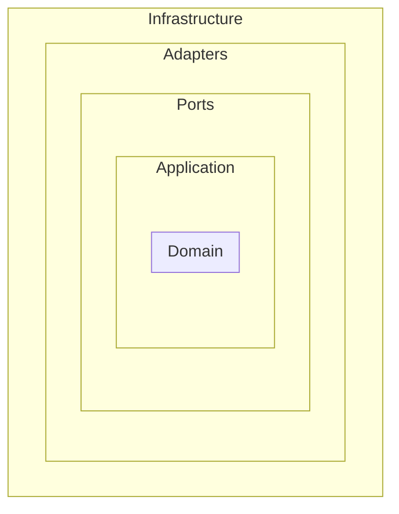
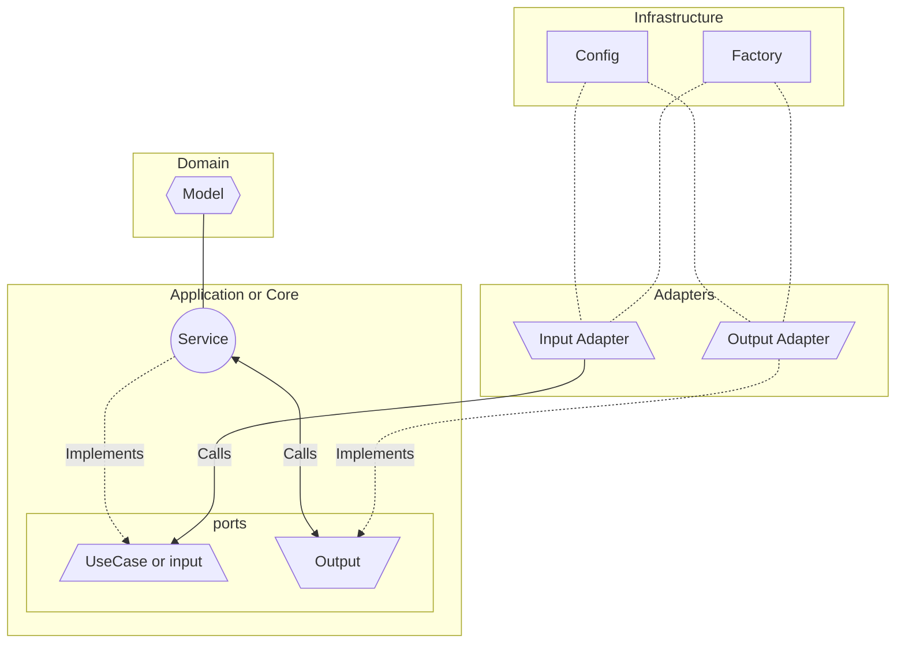

# Ports and Adapter architecture

The Ports and Adapter approach allows us to split the application in layers that will benefit code changes in a securer way.

## Overview

### Infrastructure

All code necessary to run the application, such as libraries configuration and dependency code for Adapters.

### Adapters
The outside part of hexagonal architecture are called Adapters which implement incoming data and outgoing data ports.

- **Input**: Input data adapters implementation such as http endpoints or stream data consumers. As input adapters,
  their responsibility is to use the provided infrastructure to call the application input ports (`application/ports/input`).
- **Output**: Outputs who implement outbound data handling or provide data from outside. It can be database connectors,
  http calls to external systems, external configurations, and outgoing stream providers. They must implement
  `application/ports/output` ports that are called by `application/service` implementations

### Ports
- **Input**: Use cases interfaces.
- **Output**: Outbound interfaces that declare external needs.

### Application or Core

This layer is the core of the application itself. It consists in receiving the inputs, processing them as Domains, 
and sending the proper outputs. Ports interfaces are placed in this structure.

#### Service

Services implement the "**INPUT**" use cases. 
Services also may use the out ports to send or get data that use cases ask for.

### Domain

In a domain rich with business rules, domain objects are the lifeblood of an application. Domain objects can contain 
both state and behavior. 
The closer the behavior is to the state, the easier the code will be to understand, reason about, and maintain.
Domain objects don’t have any outward dependency. They’re pure Java and provide an API for use cases to operate on them. 

## Architecture flow

## Reference

- [Ports and Adapter hexagonal](https://reflectoring.io/spring-hexagonal/)